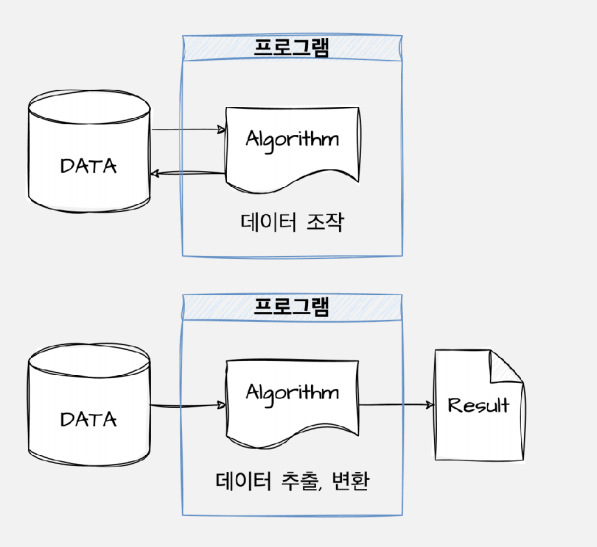
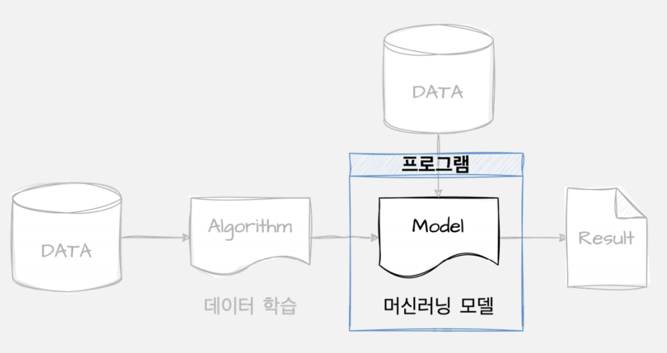
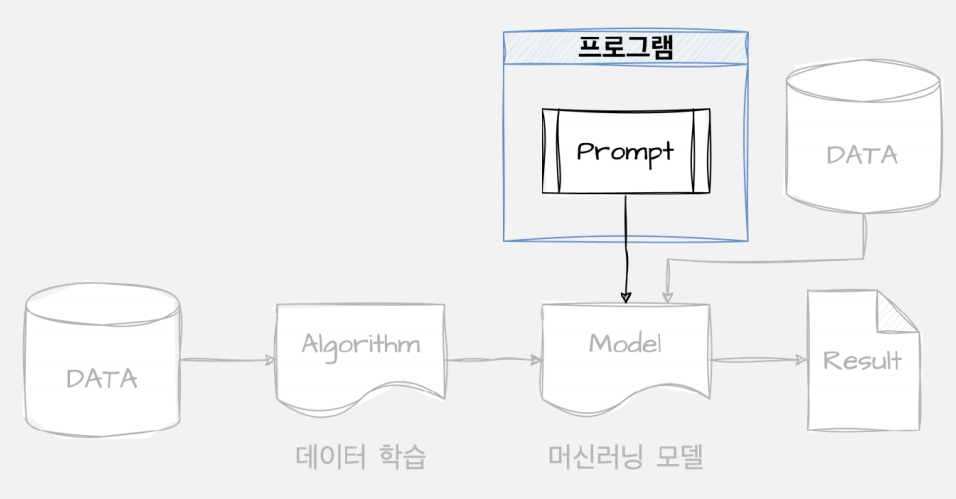
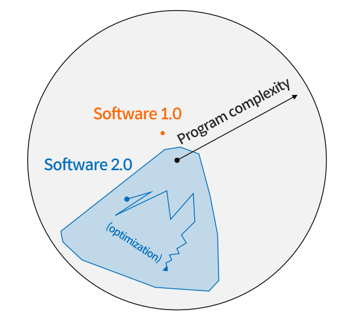
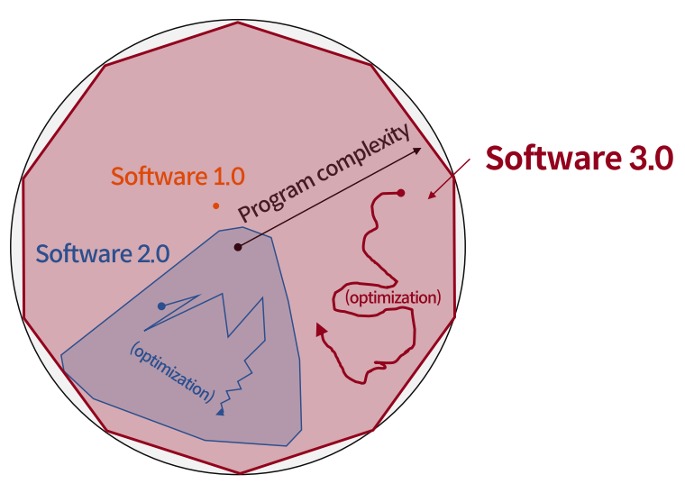
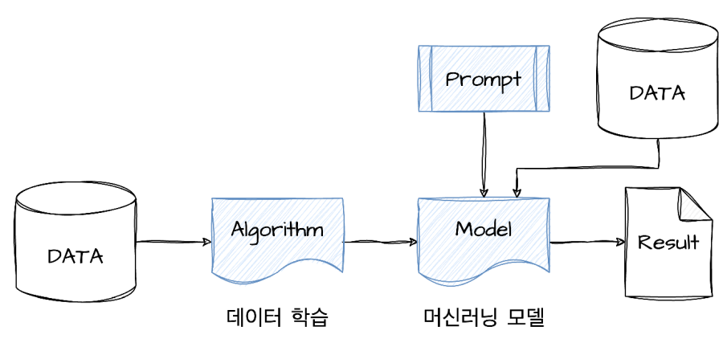

## Section 01. 소프트웨어 3.0

## 소프트웨어 개발 방식의 진화
> 소프트웨어의 구성요소는 크게 `Data` 와 `Algorithm` 으로 나뉜다.

### 소프트웨어 1.0
- `소프트웨어 1.0`은 `Data` 와 `Algorithm` 을 이용하여 **데이터를 조작**하거나, **데이터를 추출 및 변환**을 하는 작업을 말한다.

  

### 소프트웨어 2.0
- `소프트웨어 2.0`은 `Data`를 `Algorithm`을 통해 **Data를 학습시켜서 머신러닝 모델을 만들어내는 것**을 말한다.
  
  

### 소프트웨어 3.0
- `소프트웨어 3.0`은 소프트웨어 2.0에서 만든 **머신러닝 모델을 프로그램으로 제어**하는 것을 말한다.
- 이것이 `LLM`, `Chat GPT` 를 말한다.

  
- 소프트웨어 3.0이 나왔다고 해서 2.0, 1.0 이 없어지는 것이 아닌, 소프트웨어 개발 방식과 영역의 확장이다.
> **소프트웨어 1.0 시대** = 소프트웨어 1.0 
> **소프트웨어 2.0 시대** = 소프트웨어 1.0 + `소프트웨어 2.0` 
> **소프트웨어 3.0 시대** = 소프트웨어 1.0 + 소프트웨어 2.0 + `소프트웨어 3.0`

  
  

### 프롬프트 엔지니어링
> `프롬프트 엔지니어링`은 **자연어로 컴퓨터와 상호작용하는 방법**이다.

- 소프트웨어 3.0을 통해 **더 넓고 복잡한 영역**을 다루는 프로그램 개발이 가능해졌다.
- `결정론적(Code)`과 `통계적(ML)` 프로그램 양쪽 모두 개발 속도를 빠르게 한다.
- 소프트웨어 1.0 + 소프트웨어 2.0 + 소프트웨어 3.0 이 합쳐진 엔지니어링이다.

    
- `프롬프트 엔지니어링`은 **머신러닝 모델링 방법과 개발 방법을 혼합**해 놓은 것과 비슷하다.
- `프롬프트 엔지니어링`은 **실험적 방법론**에 기반하여, ***한 번 그럴듯한 결과를 내는 것이 아닌, 원하는 결과를 정확히 의도한대로 
  항상 일관성 있게 내도록 만드는 것***이다.

