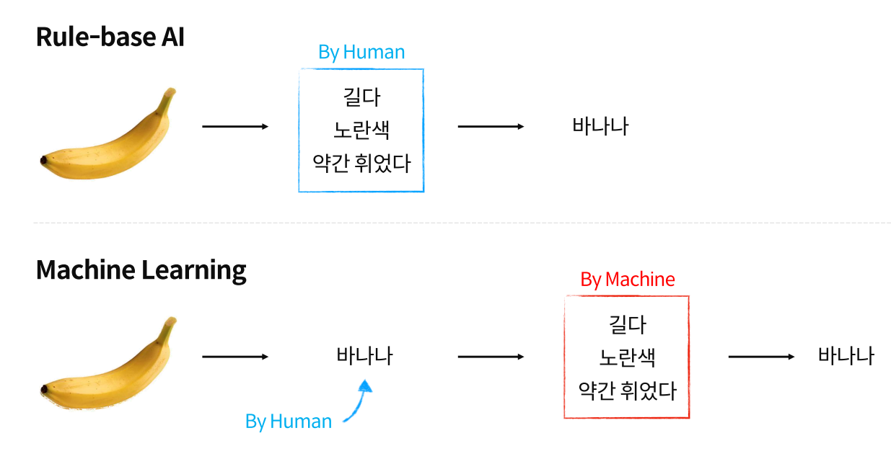
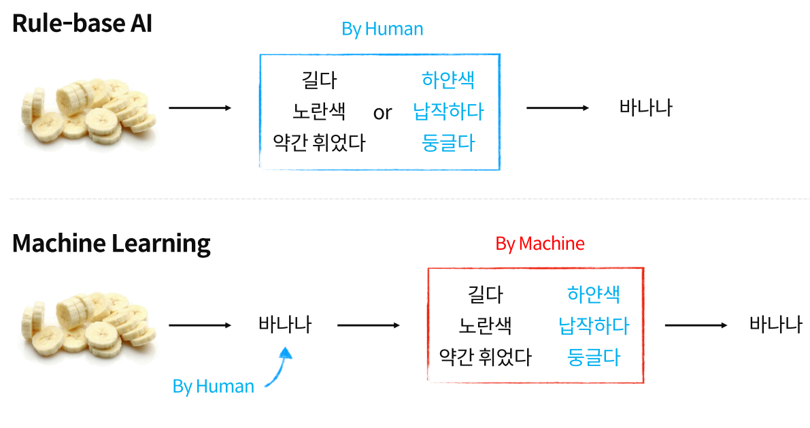
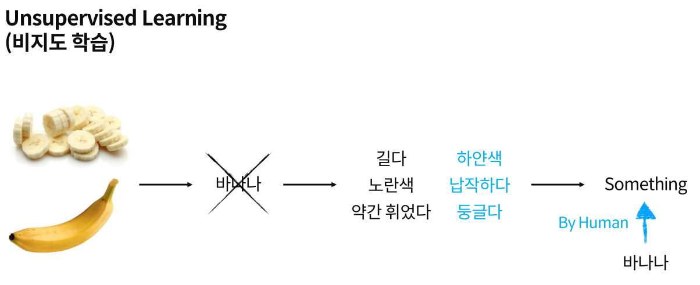
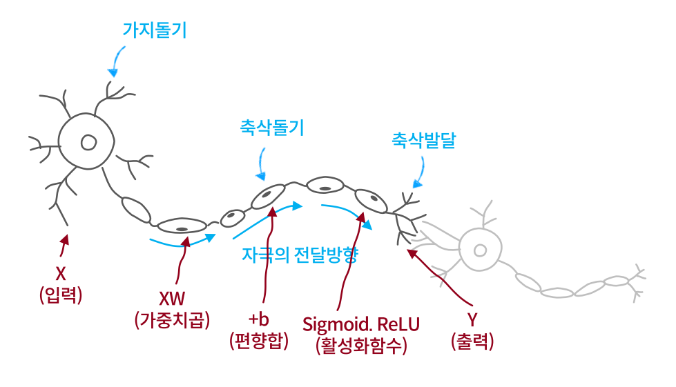
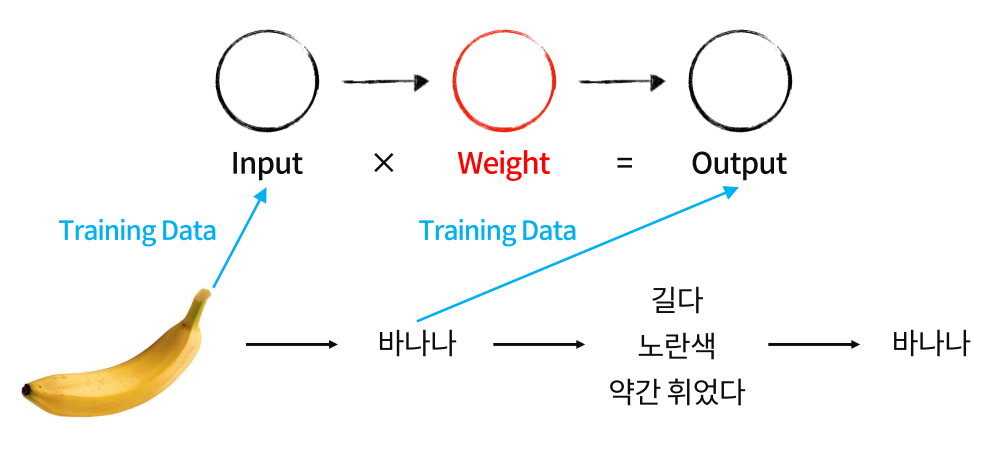
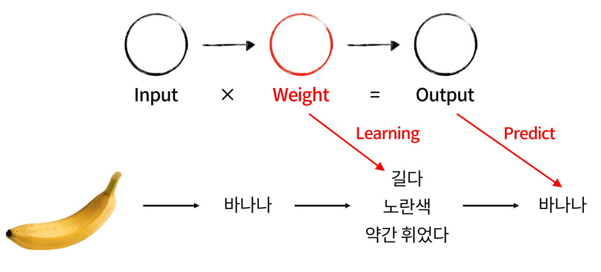
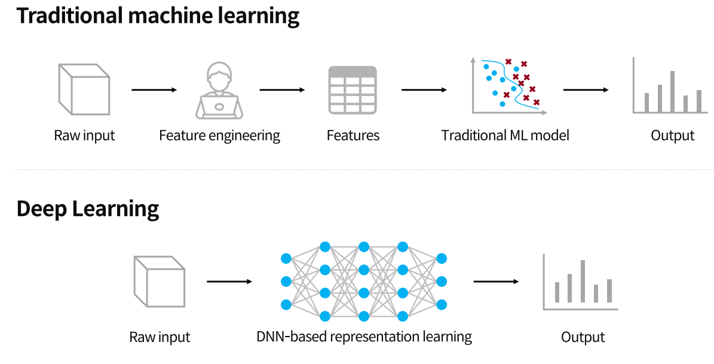

## Section 01. Machine Learning Concept

### Rule-base AI , Machine Learning
> AI 에는 `Rule-base AI` 와 `Machine Learning`로 구분될 수 있다.

- `Rule-base AI` : 사람(Human)이 물체의 특징을 알려주면 물체의 이름을 유추해 내는 것.
- `Machine Learning` : 사람(Human)이 물체의 이름을 알려주면 물체의 특징을 유추해내서 물체의 이름을 학습.

  

- `Rule-base AI` 는 물체의 다른 특징을 사람이 알려줘야 하지만 `Machine Learning`은 **물체의 또다른 특징을 스스로 유추**해 낸다.

  

> ### 💡`Unsupervised Learning`(비지도학습)이란? 
> - 물체의 사진을 보여주고 사람은 물체의 이름을 알려주지 않는다. 그리고 모델이 물체의 특징을 유추하면 
> 그 특징들을 가진것의 이름을 알려주면 모델은 다음부터 해당 특징이 나오면 물체의 이름을 인식하게 된다.
>   
>   

### Deep Learning
> `Machine Learning`의 일종으로, 사람의 뇌에서 힌트를 얻은 것이 `Deep Learning`(딥러닝)이다.

- 뇌가 뉴런을 통해서 신호를 보내고 그 신호를 받고 그 신호들이 연결이 되서 사람의 뇌의 기능을 하듯이 
  입력에서 가중치를 곱하고 결과를 출력하고 이런 연산을 다양하게 연결된 것이 딥러닝이다.

  
- 쉽게 말해 어떤 **Input 이 들어오면 Weight 을 곱하고 정확한 결과로 Output 이 나오게 하는 것**이 딥러닝이다.

  
- 위 사진을 예로 들면 `Weight` 은 바나나의 특징인데, 다음 동작때 다른 사진의 바나나가 들어오면 `가중치(Weight)`을 곱했을 때 
  Output이 나오도록 `Predict(예측)`을 하게 한다.

  

> ### 💡 `Deep Learning` 과 `Machine Learning` 의 차이점 
> - 간단히 말해 **Algorithm에 인간이 개입하는 수준이 훨씬 적은게 Deep Learning** 이다.
> 
>   

- Deep Learning 은 인간의 뇌에 엄청난 수의 뉴런들이 연결되어 있듯이 Deep Learning은 굉장히 많은 데이터를 통해 
 특징들을 표현하는 가중치와 같은 뉴런들을 쌓아서 입력값을 넣게 되면 가중치를 통해 정확한 결과를 도출할 수 있게 된다.