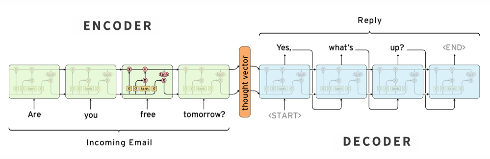
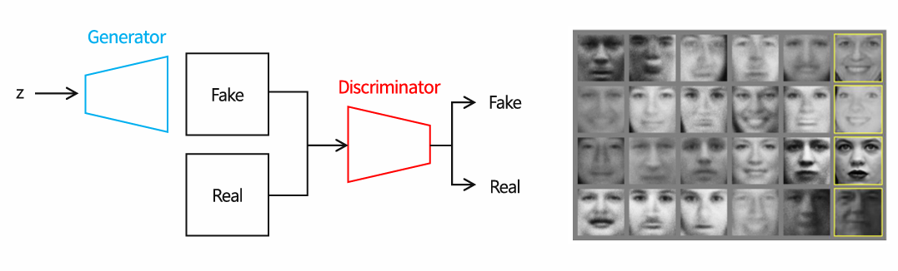
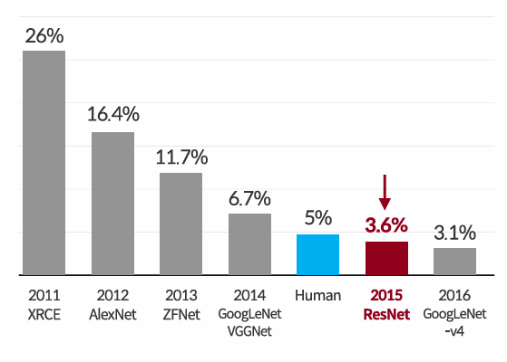
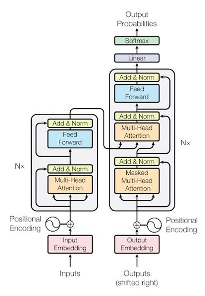
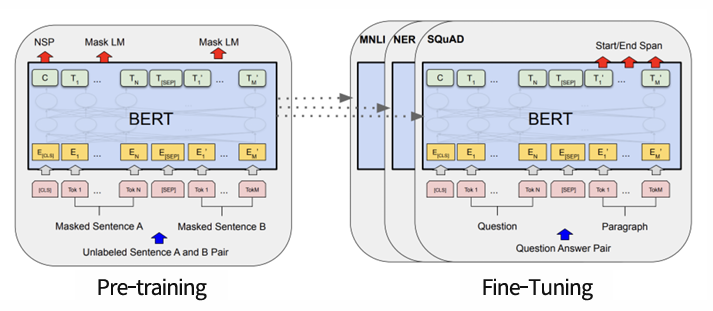
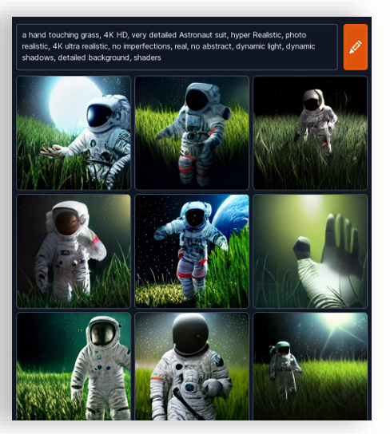
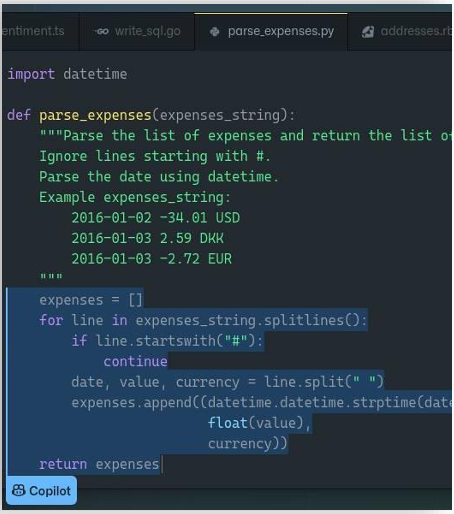
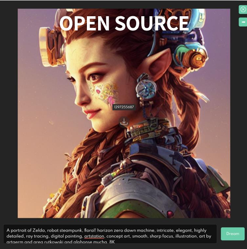

## Section 02. A Brief History of AI

### Deep Learning was Born : 딥 러닝의 탄생
- 1943 : `Neuron`
- 1985 : `Perceptron`
- 1960 : `Backpropagation`
- 1985 : `Boltzmann Machine`
- 1986 : `MLP(Multi-Layer Perceptron)`
- 1986 : `RBM(Restricted Boltzmann Machine)`
- 1986 : `RNN(Recurrent Neural Network)`
- 1986 : `Backpropagation for NN`
- 1997 : `LSTM(Long Short-Term Memory)`
- 1998 : `LeNet-5, CNN(Convolutional Neural Network)`
- 2006 : `DBN(Deep Belief Network)`
- 2008 : `GPU`
- 2009 : `ImageNet`
- 2011 : `ReLU`
- 2011 : `Common Crawl`
- 2012 : `고양이넷`
- 2012 : `AlexNet`
  - `AlexNet` 이 **기존 머신러닝 모델을 압도적으로 제치고 딥러닝이 머신러닝에 비해 우월**하다는게 증명되었다.
- 2014 : `seq2seq(sequence to sequence)`
  - 이 모델은 **텍스트영역을 딥러닝으로 해결**한 모델이다.
  - 이 기술은 **구글번역부터 현재 텍스트 번역에 근간이 되는 모델**이다.

  
- 2014 : `GAN(Generative Adversarial Networks)`
  - 이미지 인식 뿐만 아니라 이미지 생성을 하는 모델이고 현재 AI를 통한 이미지 생성의 시초가 되는 모델이다.
  - 이미지를 생성하고 뉴럴렛이 이미지가 잘 생성되었는지 평가하는 방식이다.
  
   
- 2014 : `Alexa(speaker)`
- 2014 : `Deepmind(acquired by Google)`
- 2015 : `ResNet`
  - 이 때는 이미지 인식 기술이 다른 머신러닝 모델 기술을 뛰어넘는 정도가 아닌 인간을 뛰어넘을 정도의 모델이 만들어졌다.

  
- 2015 : `TensorFlow`
- 2016 : `PyTorch`
  - TensorFlow 와 PyTorch 는 구글과 페이스북에서 만든 오픈소스 딥러닝 개발 툴이다.
- 2016 : `AlphaGo(DQN)`
- 2016 : `Google NMT`
- 2016 : `WaveNet`
- 2016 : `pix2pix`
- 2016 : `TPU(Tensor processing unit)`
- 2017 : `Deepfakes`
- 2017 : `Transformer`
  - 이 모델은 Google 에서 개발한 모델이다.
  - 텍스트 번역, 텍스트 이해 영역에 굉장히 큰 영향을 미치게 된다.
  - 추후 BERT 와 GPT를 만든 기반 기술이 되는게 Transformer 이다.
  
  
- 2018 : `AlphaZero`
- 2018 : GLUE
- 2018 : `BERT(fine-tuning, LLM)`
  - LLM의 시초의 모델이다. 파인튜닝(fine-tuning)을 통해 다양한 언어 모델을 쉽게 만들 수 있다.
  - 그동안 답이 잘 나오지 않았던 언어 인식과 생성에서 길이 열리기 시작한게 BERT 모델의 출시이다.

    
- 2018 : `GPT(generative LM)`
- 2019 : `EfficientNet(NAS/AutoML)`
- 2019 : `SuperGLUE`
- 2020 : `T5`
- 2020 : `C4`
- 2020 : `GPT-3(zero-shot)`
- 2021 : `DALL-E(CLIP 3B)`
  - GPT를 만든 OpenAI에서 만든 모델로, 장면을 설명하면 그 장면에 대한 이미지를 만드는 모델이다.

  
- 2021 : `LAION`
- 2021 : `Copilot`
  - GPT-3를 이용해서 Github에서 코들르 자동으로 생성하는 모델이다.
  - 이 때부터, 대규모 언어모델이 실질적인 문제 해결에 도움이 된다는 것이 증명됐다.

  
- 2022 : `Midjourney`
- 2022 : `Stable Diffusion`
  - 스테빌리티 AI라는 회사에서 DALL-E와 Midjourney의 준하는 성능을 가진 모델을 내놨다.

  
- 2022 : `InstructGPT`
- 2022 : `Chat GPT`