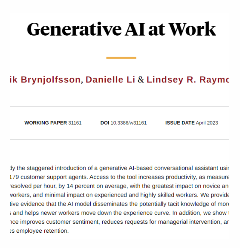
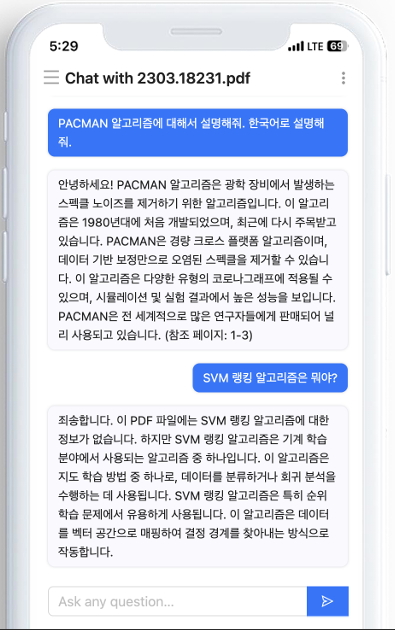
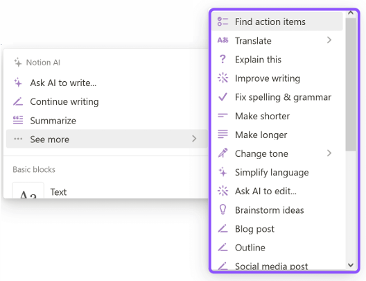
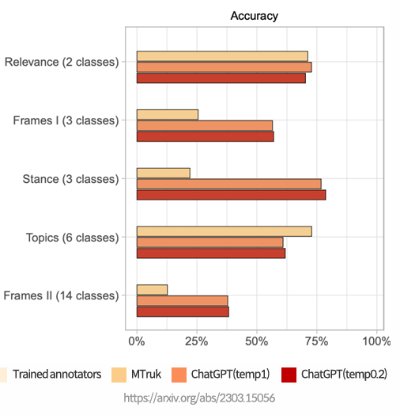
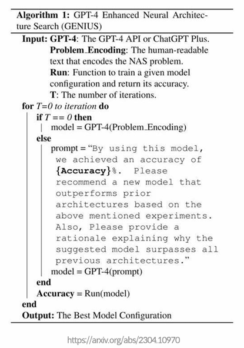
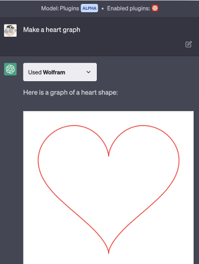

## Section 03. A Brief History of AI

### LLM, 완전히 새로운 시대의 개막

#### CS 상담원 보조
- 다음 그림은 CS 상담원에게 LLM 을 통해서 CS 상담을 더 잘할 수 있게 했을 떄 어떤 효과가 발생했는지에 대한 논문이다.

  
- **시간당 해결수가 13.8% 가 증가**하였다.
- **훈련속도가 빨라졌다.** 2개월간 AI 시스템을 사용한 상담원이 AI 시스템을 사용하지 않은 6개월 경력의 상담원 수준의 능력을 
  보이게 되었다.
- 기업 수준의 변화를 일으킴

#### ChatPDF
- PDF 파일을 올리고, 해당 파일에 대해 궁금한 내용을 질문 및 답변을 하는 시스템이다.
- **영어문서도 한국어로 질문 답변이 가능**하다.
- `LangChain`, `LlamaIndex`를 이용하면 수시간 내 개발가능하다.
 
  

#### Github Copilot
- 코드 생성, 주석 생성, 테스트 코드 생성 등 코드 생성을 도와준다.
- Copilot을 사용하는 개발자들은 **작성하는 코드의 40% 이상을 Copilot이 제안한 코드로 작성**한다.

#### Notion AI
- 초안 작성, 번역, 문장 개선, 아이디어 생성, 회의록 작성, 요약 등 **글을 작성하는 거의 모든 작업**을 도와준다.

  

#### 데이터 라벨링
- 아마존 MTurk 이라는 데이터 레이블링 회사의 결과와 비교
- MTurk 에 비해 **약 1/20 비용으로 즉시** 레이블링
- 인간보다 결과가 더 좋다.

  

#### NAS(Neural Architecture Search)
- GPT-4 를 통해 **뉴럴넷 구조를 개선**  
  - NAS 라는 것은 Neural Lab 모델을 만드는 AI 이다.
- GPT-4의 생성 기능을 활용하여 아키텍처 검색 공간을 빠르게 탐색하고 유망한 후보를 찾아내며, 이러한 후보를 
반복적으로 정제하여 성능을 향상
- GPT-4 를 이용해 LLM 모델의 뉴런을 해석

  

#### ChatGPT(Major Product)
- 슈퍼 휴먼 레벨의 채팅형 에이전트
- Plugin 을 통한 무한한 기능 확장
  - 프로그램 코드 이해
  - 비정형 데이터 ↔ 정형 데이터 추출 및 생성
  - AI가 도구를 사용할 수 있게 됨.

  

  