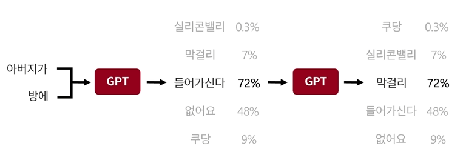
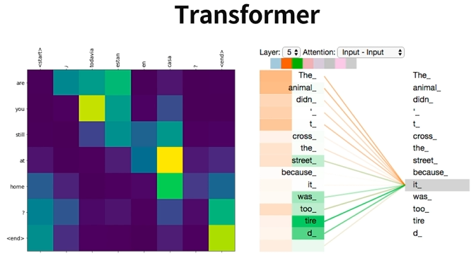
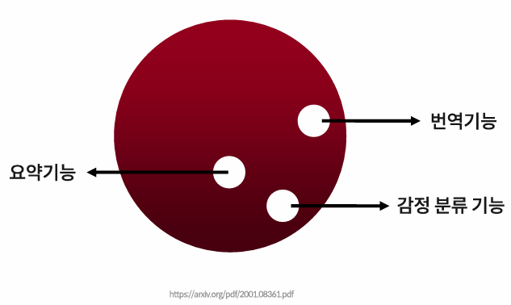
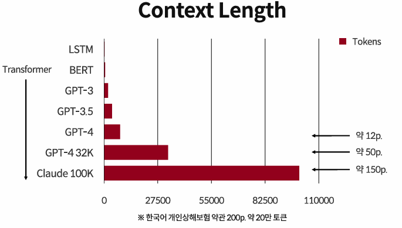
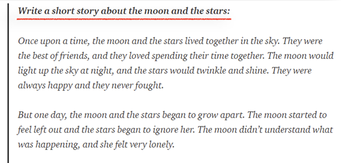
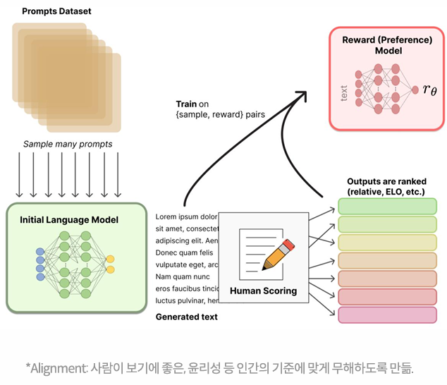

## Section 03. A Brief History of AI

### LLM, 완전히 새로운 시대의 개막

#### 1. Autoregressive Model
- GPT 같은 모델을 `Autoregressive Model` 이라 한다.
- `Seq2Seq` 와 비슷한 방식으로 동작한다.
- 두 개의 단어가 들어오면 **GPT는 2개의 단어를 주면 다음 단어를 예측**하는데, 이 때 여러 단어중 
**확률이 가장 높은 단어를 선택**하는 방식이다.
- 그리고 그렇게 조합된 단어들 다음에 올 단어를 다시 예측하여 선택한다.

  

#### 2. Transformer
- 위 기술을 `Transformer` 라는 기술에 의해 가능하게 되었다.
- `Transformer` 이전에도 충분히 가능했지만 `Transformer` 기술 덕에 더 정확하고 더 의미를 잘 이해할 수 있게 됐다.

  
- `Transformer` 라는 기술을 여러 가지 텍스트들이 순서대로 나열이 되어 있을 때, **그 다음 단어가 어떤 단어에 집중하는지 판단하고 집중할 단어에 맞춰서 다음 단어를 생성하는 방법**이다.

#### 3. Scaling Laws
- 이 언어 모델을 대량의 텍스트를 줘서 학습 시켜서 모델을 키웠다.
- 학습을 시켜서 어느 정도 수준의 크기로 키우니 모델 안에 감정 분류 기능이 생기고 좀 더 키우니 요약 기능, 번역 기능이 추가되었다. 
- 이렇게 모델을 크게 키우면 키울수록 따로 학습을 시키지 않아도 여러 가지 기능들이 생겨났고 계속 모델을 키우고 지금의 GPT 가 되었다.

  

#### Context Length
- 최근에는 많은 회사들이 `Context Length`를 키우려고 노력을 하고 있다.
- `Context Length`는 텍스트를 생성할 수 있는 길이, 텍스트를 이해할 수 있는 길이를 뜻한다.
- `Transformer` 모델 이전에는 약 한 문단 정도의 텍스트를 이해해서 생성할 수 있었다.
- 하지만 `BERT` 모델 이후 부터 급격하게 `Context Length` 를 늘릴 수 있게 되었다.

  
- 가장 중요한 부분 중 하나는 코드 데이터를 학습한 것이다.
- 코드 데이터를 학습함으로 인해 추론 능력이 향상되었고, 정형 데이터를 생성할 수 있게 됐다.
- GPT 3.5 는 코드를 학습한 걸 기반으로 일반적인 언어를 학습해서 능력을 갖춘 모델이다.

#### Instruction Tuning
- `Instruction Tuning` 이전에는 텍스트를 생성할 때 텍스트 뒤에 올 단어를 추론해서 생성
- `Instruction Tuning` 은 사람(개발자)의 명령을 이해해서 그 명령을 가지고 그 다음에 올 텍스트를 생성하는 방식이다.
- 이를 통해 챗봇이 가능해지고 다양한 어플리케이션이 되는것이다.

  

#### RLHF(Reinforce Learning from Human Feedback)
- RLHF 라는 기술을 통해서 성능을 크게 향상시킬 수 있었다.
- GPTA 와 GPT-B가 있고, GPTA 가 생성한 것을 사람이 평가를하고, 평가를 기반으로 LLM 이 '이렇게 해야 사람이 좋아하는구나' 혹은 '이렇게 해야지 사람과 비슷하게 생성하구나' 를 판단하여 그걸 기반으로 LLM 모델을 학습시켜 더 사람이 원하는 형태로 텍스트를 생성하도록 만드는 기술이다.

  
